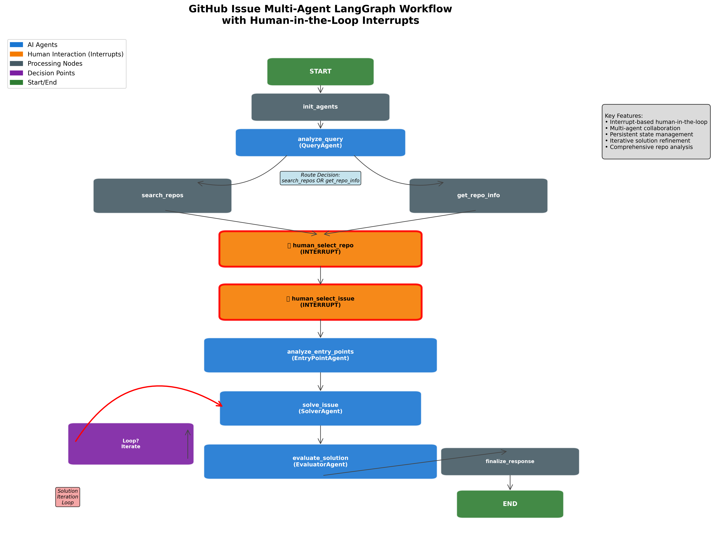
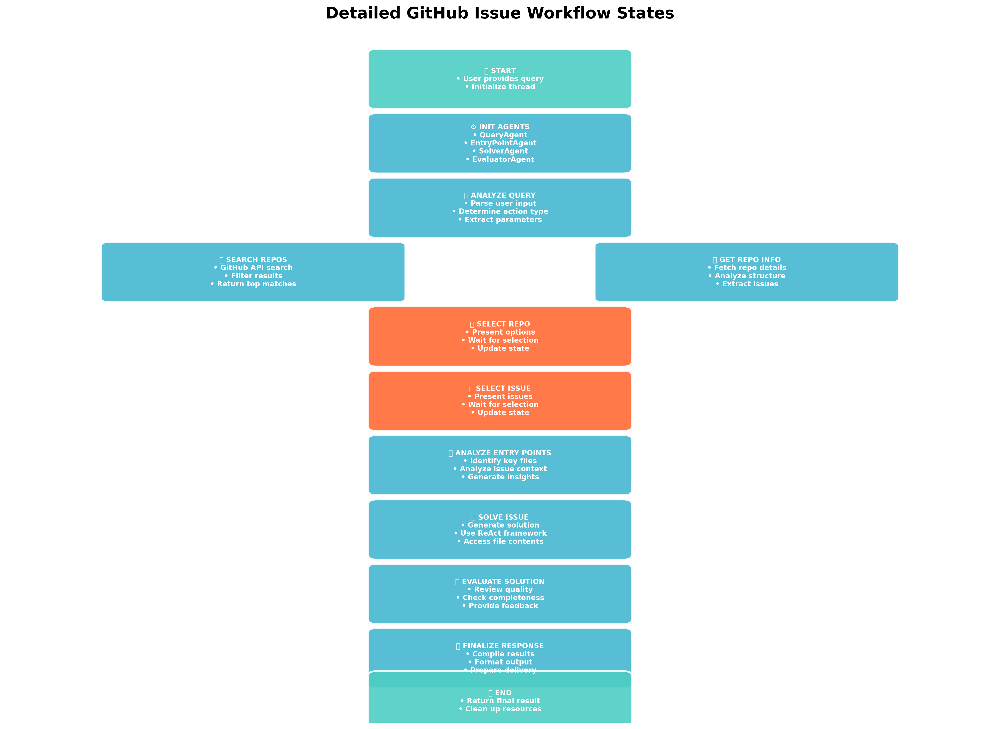

# OpenSource-Github-Multi-Agent-LangGraph-Researcher




## Purpose

This project is designed to automate and enhance the process of researching, analyzing, and solving issues in open-source GitHub repositories. It leverages multiple AI agents (LLMs) orchestrated via a LangGraph workflow, allowing for both automated and human-in-the-loop decision making. The system can search for repositories, analyze their structure and issues, and propose step-by-step solutions, pausing for human input at key points for selection and review.

## What is this repo about?

This repository contains a modular Python framework for multi-agent collaboration on GitHub issue analysis and resolution. It integrates:
- LangGraph for workflow orchestration and state management
- LangChain-style agents for query analysis, entry point breakdown, solution generation, and evaluation
- Search and file tools for web and repo data gathering
- Human-in-the-loop interrupts for selection and review
- Visualization scripts and pre-generated diagrams to help understand the workflow

The included workflow diagrams above illustrate the step-by-step process and agent interactions.

## Quick overview

- Purpose: orchestrate multiple LLM-powered agents to search, analyze, and propose fixes for GitHub issues with explicit human-in-the-loop interrupt points.
- Built with: Python, LangGraph (StateGraph + interrupts), LangChain-style agents, Pydantic models, and a small set of tools (Serper, Tavily, GitHub file reader).
- Location of key artifacts: the visual diagrams live at `workflow_diagram.png` and `detailed_workflow.png` in the repo root.

## What this project contains

- `agents/` — Agent implementations and the main `agents/workflow.py` which defines the LangGraph StateGraph and compiled app (with MemorySaver checkpointer and human interrupts).
- `core/` — API clients and repository analysis helpers (e.g., `get_repo_info.py`, `graphql_search_repo.py`).
- `create_workflow_images.py` — Matplotlib-based script to generate `workflow_diagram.png`, `workflow_diagram.pdf`, `workflow_diagram.svg`, and `detailed_workflow.png`.
- `visualize_workflow.py` — Uses the compiled LangGraph app graph to try to render a Mermaid PNG; falls back to ASCII and a manual description.
- `test_workflow.py` — A small harness that exercises the workflow and simulates human input.
- `workflow_diagram.png`, `detailed_workflow.png` — Pre-generated visual artifacts included for convenience.

## Architecture & workflow (high-level)

The workflow implemented in `agents/workflow.py` follows this flow:

1. init_agents — initialize workflow state (no agent instances are stored in the state to avoid serialization issues)
2. analyze_query — `QueryAgent` determines whether to do `get_repo_info` or `search_repos`
3. search_repos / get_repo_info — collect candidate repositories or fetch repo details
4. human_select_repo — INTERRUPT: workflow pauses and waits for a human selection (configured as interrupt)
5. get_repo_info — if needed, fetch detailed repo info and issues
6. human_select_issue — INTERRUPT: workflow pauses and waits for human issue selection
7. analyze_entry_points — `EntryPointAndIssueBreakdownAgent` inspects files and identifies relevant entry points
8. solve_issue — `SolverAgent` (ReAct-style) generates a proposed solution using tools (search, file fetch)
9. evaluate_solution — `EvaluatorAgent` reviews and scores the solution; may loop back to `solve_issue`
10. finalize_response → end_workflow

Key points:

- Human-in-the-loop is implemented using LangGraph interrupts configured at compile time (see `interrupt_before=["human_select_repo","human_select_issue"]` in `agents/workflow.py`).
- Persistent state is stored with the `MemorySaver` checkpointer so the workflow can pause and resume without re-running from the start.

## Visuals

Pre-generated images:

- `workflow_diagram.png` — a concise diagram of nodes and interrupts.
- `detailed_workflow.png` — a detailed flow chart describing states and transitions.

Regenerate images locally (PowerShell examples):

1) Using the Matplotlib generator (recommended; produces PNG/PDF/SVG):

```powershell
python .\create_workflow_images.py
```

This will write `workflow_diagram.png`, `workflow_diagram.pdf`, `workflow_diagram.svg`, and `detailed_workflow.png` to the repository root.

2) Using the compiled LangGraph app (best-effort; may fail depending on your environment and LangGraph build):

```powershell
python .\visualize_workflow.py
```

`visualize_workflow.py` attempts to call the compiled app's `app.get_graph().draw_mermaid_png()` method. If that call fails it will fall back to an ASCII diagram written to `workflow_ascii.txt` and print a manual workflow description.

## How to run the workflow (quick)

1. Create a `.env` (or set env vars) with required API keys. An example `.env.example` is included.

Required variables (examples):

```
GITHUB_API_KEY=your_github_token
SERPER_API_SECRET=your_serper_key
TAVILY_API_SECRET=your_tavily_key
GEMINI_API_KEY=your_gemini_key
GEMINI_MODEL=text-bison-001
```

2. Install dependencies (this repo includes `requirements.in` and `requirements.txt`). Using pip in the provided virtual environment is recommended:

```powershell
python -m pip install -r .\requirements.txt
```

3. Run the basic workflow test harness:

```powershell
python .\test_workflow.py
```

`test_workflow.py` shows how to start the workflow, wait for interrupts, and programmatically call `handle_human_input(...)` to resume the flow.

## Important implementation notes & known issues

- Human interrupts: the workflow pauses at `human_select_repo` and `human_select_issue` using LangGraph interrupts; you resume by calling `GitHubIssueWorkflow.handle_human_input(thread_id, input_type, user_input)` which updates persisted state and streams the continuation.
- GraphQL search results: the `search_github_repositories` function returns a nested GraphQL dict. The workflow flattens `search.edges[*].node` into a list of repo dictionaries in `_search_repos_node`.
- SolverAgent tool inputs: the `SolverAgent` uses a ReAct pattern and must pass tool inputs as structured JSON/dicts (example formats are included in the prompt template inside `agents/solver_agent.py`). If the ReAct agent emits action inputs as plain concatenated strings (e.g., "repo_url: ... file_path: ..."), tools backed by Pydantic will raise validation errors (missing required fields). Workarounds:
  - Ensure the ReAct agent is instructed to emit the exact JSON for `Action Input` (examples are in the prompt template).
  - Add a small parsing wrapper around tool invocation that accepts human-readable key/value text and converts it into the expected dict before calling the tool (this repo contains places where such normalization was considered).

## Tests and development

- Unit/test harnesses: `test_workflow.py`, `test_solver_agent.py` are included as simple entry points for iterative development.
- Linting/type checks: Pylance-type issues and serialization problems were addressed by avoiding storing agent instances in the persistent `WorkflowState` and by returning simple JSON-serializable structures from nodes.

## File layout (top-level)

- `agents/` — workflow and agents
- `core/` — helpers and tools
- `config/` — settings and configuration
- `utils/` — logging utilities
- `create_workflow_images.py` — diagram generator
- `visualize_workflow.py` — app-based visualization
- `test_workflow.py` — test harness
- `workflow_diagram.png`, `detailed_workflow.png` — included images

## Contribution & license

If you want to contribute, open an issue or a PR describing the improvement. Tests and small incremental changes are appreciated.

This project is released under the MIT license.

----

If you'd like, I can also:

- add a short `docs/` folder with the Mermaid source or additional diagrams;
- fix the `SolverAgent` tool-input normalization so ReAct outputs are always parsed into the expected structured dicts (this will remove the Pydantic validation failures observed when tool inputs arrive as free text).

Status: README updated to reflect codebase structure, workflow details, and how to regenerate the workflow diagrams.

